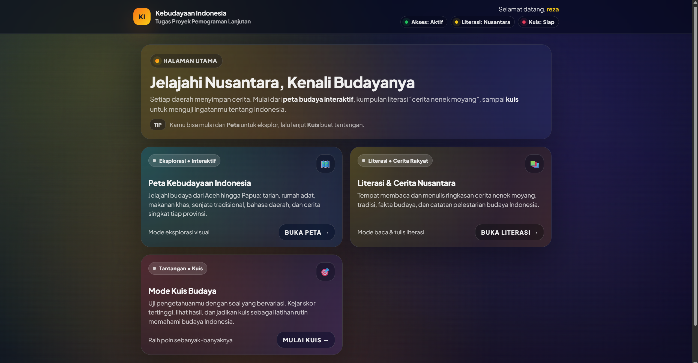

# 🗺️ Peta Budaya Indonesia  
### Platform Edukasi Interaktif Berbasis Web


---

## 📖 Deskripsi

**Peta Budaya Indonesia** adalah aplikasi edukasi berbasis web yang bertujuan untuk memperkenalkan dan melestarikan kekayaan budaya Indonesia.  
Aplikasi ini menyajikan **informasi budaya berbasis peta interaktif** serta **fitur kuis** untuk menguji dan meningkatkan pemahaman pengguna mengenai budaya Nusantara.

Project ini dikembangkan menggunakan **Laravel Framework** sebagai hasil **migrasi dari PHP native ke Laravel**, sehingga memiliki struktur kode yang lebih rapi, aman, dan mudah dikembangkan.

Aplikasi tersedia dalam dua platform:
- 🌐 **Web Application (Laravel)**
- 📱 **Mobile Application (Android – WebView)**

---

## 🎯 Tujuan Pengembangan

- 🇮🇩 Mengenalkan keberagaman budaya Indonesia
- 🗺️ Menyediakan peta budaya interaktif per daerah
- 🎮 Meningkatkan minat belajar melalui kuis budaya
- 🔐 Menyediakan sistem login untuk keamanan akses
- 📱 Mendukung penggunaan di web dan aplikasi mobile (WebView)

---

## 🧩 Tech Stack

### Backend (Web)
- **Laravel 11**
- PHP >= 8.2
- MySQL / SQLite
- Blade Template
- TailwindCSS

### Mobile
- Android Studio
- Kotlin
- Android WebView
- Emulator Pixel (API 33)

### Frontend
- Blade Template
- HTML, CSS, JavaScript

### Database
- MySQL / SQLite

### Tools
- Git & GitHub
- XAMPP
- Android WebView (Mobile)

---

## 📐 SDLC (Software Development Life Cycle)

Metodologi yang digunakan: **Waterfall dengan iterasi**

| Phase | Aktivitas | Output |
|------|----------|--------|
| 1. Planning | Requirement gathering, user story | PRD, User Stories |
| 2. Analysis | Analisis kebutuhan & fitur | SRS Document |
| 3. Design | UML, desain database, mockup | UML, ERD |
| 4. Development | Implementasi Laravel & Android | Source Code |
| 5. Testing | Pengujian fitur | Test Case |
| 6. Deployment | Hosting & build APK | Aplikasi |
| 7. Maintenance | Perbaikan & pengembangan | Update |

---

## 📊 Struktur Database (Sederhana)

| Tabel | Deskripsi |
|-----|----------|
| users | Data pengguna |
| quiz_results | Hasil kuis pengguna |
| budaya | Data budaya per daerah |
| stories | Cerita nenek moyang |

---

## 🔌 REST API Endpoint (Internal)

| Method | Endpoint | Deskripsi |
|------|---------|----------|
| GET | /api/budaya | Mengambil data budaya |
| GET | /api/quiz | Mengambil soal kuis |
| POST | /api/quiz/result | Simpan hasil kuis |
| GET | /api/leaderboard | Data skor tertinggi |

---

## 👤 User Story

| ID | User Story | Priority |
|----|-----------|----------|
| US-01 | Sebagai user, saya ingin login agar dapat mengakses fitur aplikasi | High |
| US-02 | Sebagai user, saya ingin melihat peta budaya Indonesia | High |
| US-03 | Sebagai user, saya ingin melihat detail budaya tiap daerah | High |
| US-04 | Sebagai user, saya ingin mengerjakan kuis budaya | High |
| US-05 | Sebagai user, saya ingin memilih tingkat kesulitan kuis | Medium |
| US-06 | Sebagai admin, saya ingin mengelola data budaya dan konten | Medium |

---

## 📋 Fitur Utama (SRS)

### Functional Requirements

| ID | Fitur | Deskripsi | Status |
|----|------|----------|--------|
| FR-01 | Authentication | Login & Logout User | ✅ Done |
| FR-02 | Session Protection | Proteksi halaman dengan middleware | ✅ Done |
| FR-03 | Peta Budaya | Peta budaya Indonesia | ✅ Done |
| FR-04 | Detail Budaya | Informasi budaya tiap daerah | ✅ Done |
| FR-05 | Quiz Budaya | Kuis budaya interaktif | ✅ Done |
| FR-06 | Level Quiz | Mudah, Normal, Sulit | ✅ Done |
| FR-07 | Migrasi Sistem | PHP Native → Laravel | ✅ Done |

---

## 🔐 Keamanan Aplikasi

- Session-based authentication
- Middleware `RequireLogin`
- File `.env` tidak diunggah ke repository
- Struktur MVC Laravel
  
---

## 📊 UML Diagrams

### Use Case Diagram


### Class Diagram


### Sequence Diagram


### Activity Diagram


---

## 💻 Mockup & Screenshot

### Halaman Login


### Halaman Utama


### Halaman Peta Budaya


### Halaman Fitur Peta Budaya


### Halaman Literasi & Pemberitahuan


### Halaman Fitur Literasi & Pemberitahuan


### Halaman Utama Kuis


### Halaman Fitur Nama Kuis


### Halaman Proses Kuis


---

## ⚙️ Instalasi (Web Laravel)

### Prasyarat
Pastikan sudah terinstall:
- PHP >= 8.2
- Composer
- Node.js & NPM
- MySQL
- Git

### Langkah Instalasi

```bash
git clone https://github.com/USERNAME/budaya-laravel.git
cd budaya-laravel
composer install
npm install
cp .env.example .env
php artisan key:generate
php artisan migrate
php artisan serve
```
Akses di Browser : http://127.0.0.1:8000

## ⚠️ Troubleshooting

| Error | Penyebab Umum | Solusi |
|------|---------------|--------|
| `SQLSTATE: no such table` | Belum migrate | Jalankan: `php artisan migrate` |
| `Vite manifest not found` | Asset belum dibuild | Jalankan: `npm install` lalu `npm run build` |
| `Permission denied` | Permission folder storage/cache | Jalankan: `chmod -R 775 storage bootstrap/cache` *(Linux/Mac)* |
| `Class not found` | Autoload composer belum update | Jalankan: `composer dump-autoload` |
| `View not found` | File blade belum ada / salah path | Pastikan file ada di `resources/views/...` |
| `The webpage not available (Android WebView)` | Emulator tidak bisa akses localhost PC | Pakai URL: `http://10.0.2.2:8000` (emulator) |

---

### 💁🏻 Author
Muhammad Reza Al Ichwan
