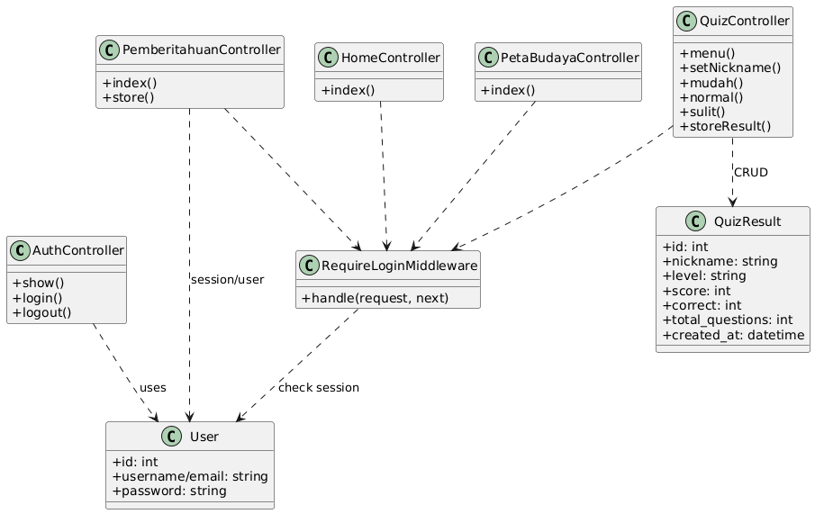
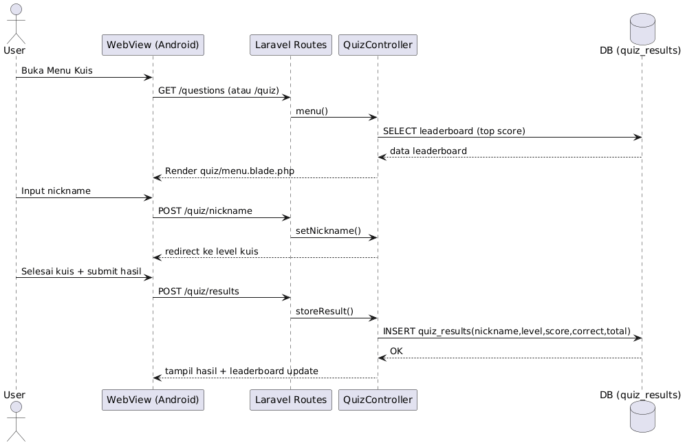
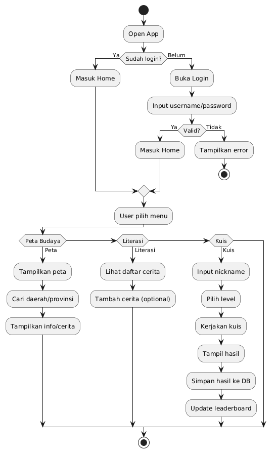
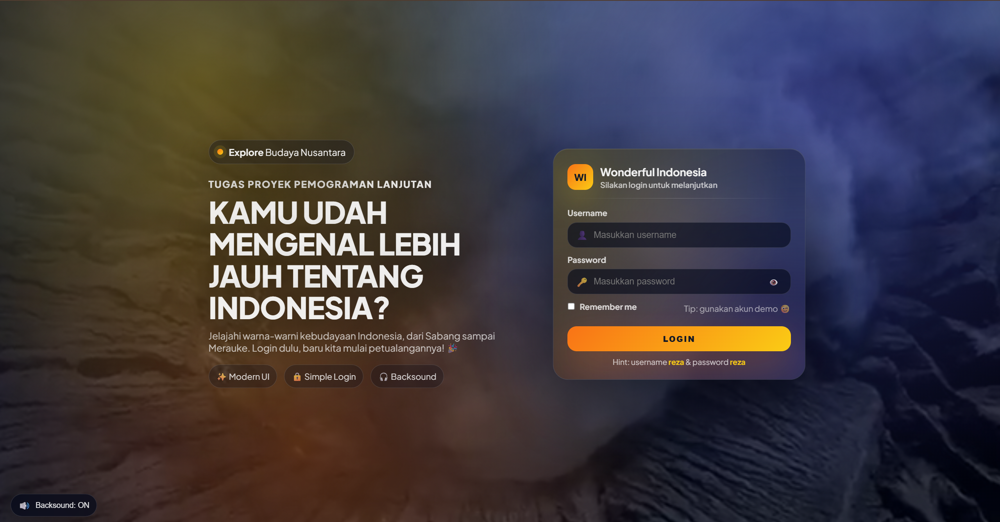
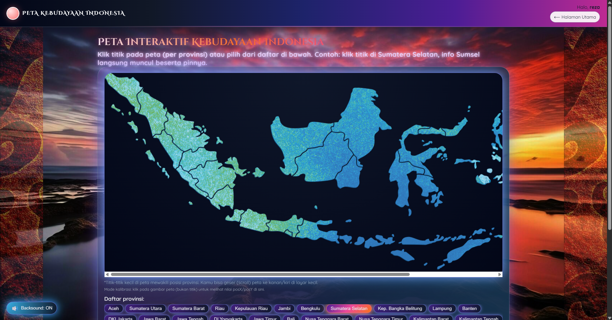
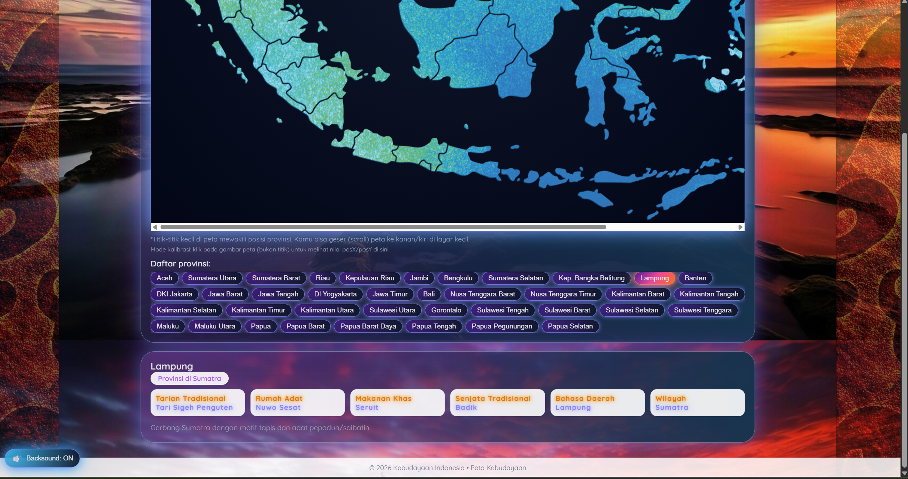
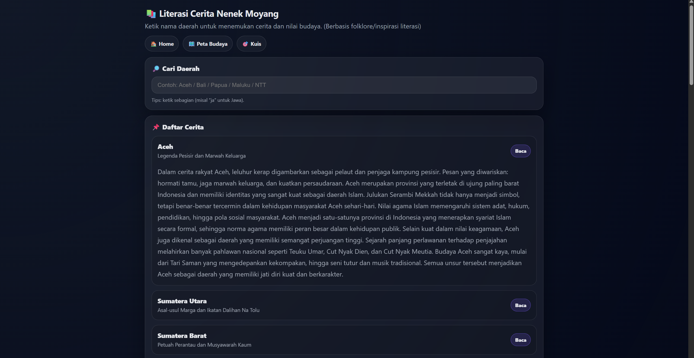
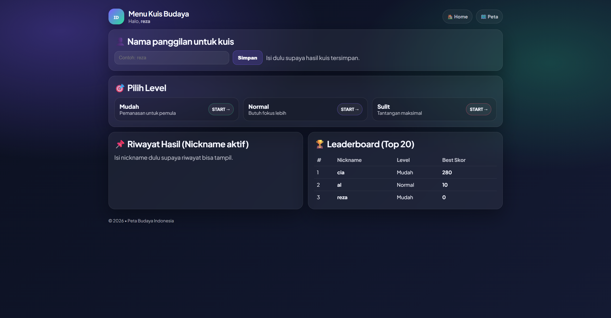
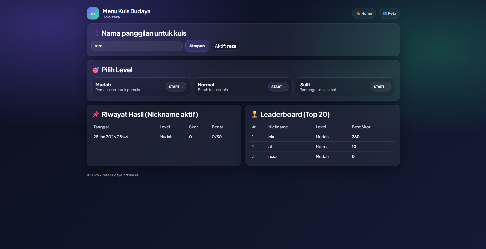
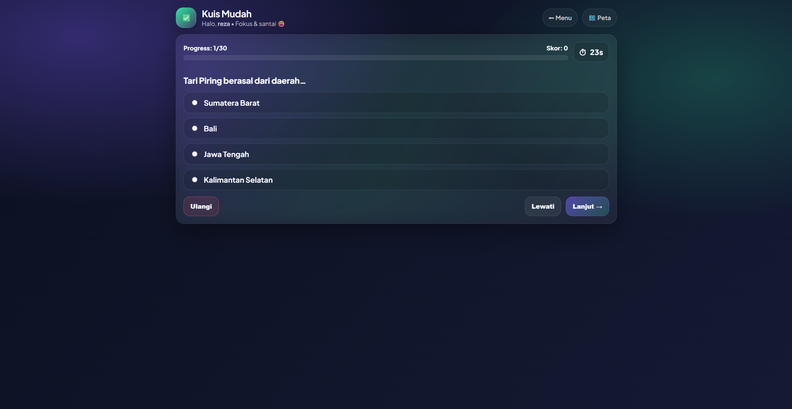

# 🗺️ Peta Budaya Indonesia  
### Platform Edukasi Interaktif Berbasis Web


---

## 📖 Deskripsi

**Peta Budaya Indonesia** adalah aplikasi edukasi berbasis web yang bertujuan untuk memperkenalkan dan melestarikan kekayaan budaya Indonesia.  
Aplikasi ini menyajikan **informasi budaya berbasis peta interaktif** serta **fitur kuis** untuk menguji dan meningkatkan pemahaman pengguna mengenai budaya Nusantara.

Project ini dikembangkan menggunakan **Laravel Framework** sebagai hasil **migrasi dari PHP native ke Laravel**, sehingga memiliki struktur kode yang lebih rapi, aman, dan mudah dikembangkan.

---

## 🎯 Tujuan Pengembangan

- 🇮🇩 Mengenalkan keberagaman budaya Indonesia
- 🗺️ Menyediakan peta budaya interaktif per daerah
- 🎮 Meningkatkan minat belajar melalui kuis budaya
- 🔐 Menyediakan sistem login untuk keamanan akses
- 📱 Mendukung penggunaan di web dan aplikasi mobile (WebView)

---

## 🧩 Tech Stack

### Backend
- **Laravel 12**
- PHP **8.2**

### Frontend
- Blade Template
- HTML, CSS, JavaScript

### Database
- MySQL / SQLite

### Tools
- Git & GitHub
- XAMPP
- Android WebView (Mobile)

---

## 👤 User Story

| ID | User Story | Priority |
|----|-----------|----------|
| US-01 | Sebagai user, saya ingin login agar dapat mengakses fitur aplikasi | High |
| US-02 | Sebagai user, saya ingin melihat peta budaya Indonesia | High |
| US-03 | Sebagai user, saya ingin melihat detail budaya tiap daerah | High |
| US-04 | Sebagai user, saya ingin mengerjakan kuis budaya | High |
| US-05 | Sebagai user, saya ingin memilih tingkat kesulitan kuis | Medium |
| US-06 | Sebagai admin, saya ingin mengelola data budaya dan konten | Medium |

---

## 📋 Fitur Utama (SRS)

### Functional Requirements

| ID | Fitur | Deskripsi | Status |
|----|------|----------|--------|
| FR-01 | Authentication | Login & Logout User | ✅ Done |
| FR-02 | Session Protection | Proteksi halaman dengan middleware | ✅ Done |
| FR-03 | Peta Budaya | Peta budaya Indonesia | ✅ Done |
| FR-04 | Detail Budaya | Informasi budaya tiap daerah | ✅ Done |
| FR-05 | Quiz Budaya | Kuis budaya interaktif | ✅ Done |
| FR-06 | Level Quiz | Mudah, Normal, Sulit | ✅ Done |
| FR-07 | Migrasi Sistem | PHP Native → Laravel | ✅ Done |

---

## 🔐 Keamanan Aplikasi

- Session-based authentication
- Middleware `RequireLogin`
- File `.env` tidak diunggah ke repository
- Struktur MVC Laravel

---

## 🚀 Cara Menjalankan Project

### 1️⃣ Clone Repository
```bash
git clone https://github.com/USERNAME/budaya-laravel.git
cd budaya-laravel
```
---

## UML Diagrams

### Use Case Diagram


### Class Diagram


### Sequence Diagram


### Activity Diagram


---

## Mockup & Screenshot

### Halaman Login


### Halaman Utama


### Halaman Peta Budaya


### Halaman Fitur Peta Budaya


### Halaman Literasi & Pemberitahuan


### Halaman Fitur Literasi & Pemberitahuan


### Halaman Utama Kuis


### Halaman Fitur Nama Kuis


### Halaman Proses Kuis

